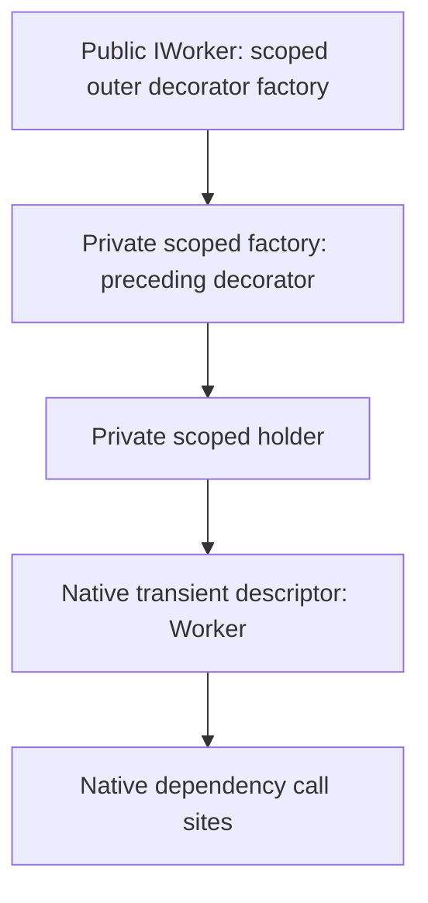

# Decoration: native activation, caching, and disposal ownership

This document explains [PR #124](https://github.com/PrimordialCode/Mammoth.Extensions.DependencyInjection/pull/124), which fixes [issue #121](https://github.com/PrimordialCode/Mammoth.Extensions.DependencyInjection/issues/121). The design restores native Microsoft DI constructor planning for decorated original **implementation-type registrations**, while retaining independent disposal ownership and registration isolation. These changes belong to the release after 0.8.0; they are not guarantees of the published 0.8.0 package.

For application setup, see the [usage guide](../README.md#decorator) and [keyed ownership recipe](../.agents/skills/mammoth-di/references/usage.md#keyed-decorators-and-caller-owned-instances). The implementation is in [ServiceCollectionExtensions.Decorators.cs](../src/Mammoth.Extensions.DependencyInjection/ServiceCollectionExtensions.Decorators.cs) and [DecorationServiceType.cs](../src/Mammoth.Extensions.DependencyInjection/DecorationServiceType.cs).

## The ownership rule

> **Decorators must not dispose their injected inner service.** This applies to both `Dispose()` and `DisposeAsync()`.

DI tracks each container-created original and each decorator independently. A decorator disposes only resources that it creates and owns itself. Injecting an inner service does not transfer its ownership to the decorator. This follows [Microsoft's DI ownership guidance](https://learn.microsoft.com/en-us/dotnet/core/extensions/dependency-injection/guidelines#general-idisposable-guidelines).

| Registration/layer | Owner responsible for disposal |
| --- | --- |
| Original registered by implementation type | DI's owning scope/provider |
| Original returned from an implementation factory | DI's owning scope/provider |
| Every container-created decorator, including intermediate layers | DI's owning scope/provider |
| Original supplied through an instance overload | The caller |
| Private scoped holder | Non-disposable; it stores a reference only |
| Resource created inside a decorator, such as its own buffer | That decorator |

These implementations are incorrect for an injected inner service:

```csharp
// Incorrect: DI or the caller already owns _inner.
public void Dispose() => _inner.Dispose();
public ValueTask DisposeAsync() => _inner.DisposeAsync();
```

Forwarding disposal can dispose an original or intermediate decorator twice. With a supplied instance, it can dispose an object the caller still intends to use. A decorator that owns no resources can omit `IDisposable`/`IAsyncDisposable`, even if its inner implements them.

This complete example creates two scoped decorators. Each owns its buffer; neither disposes `Inner`. Async scope disposal cleans up both decorators and the original exactly once.

<!-- runnable: scoped-ownership -->
```csharp
using Microsoft.Extensions.DependencyInjection;
using Mammoth.Extensions.DependencyInjection;

IServiceCollection services = new ServiceCollection();
services.AddScoped<IWorker, Worker>();
services.Decorate<IWorker, BufferedWorker>();
services.Decorate<IWorker, BufferedWorker>();

await using var provider = services.BuildServiceProvider(
    new ServiceProviderOptions { ValidateOnBuild = true, ValidateScopes = true });
var scope = provider.CreateAsyncScope();
var outer = (BufferedWorker)scope.ServiceProvider.GetRequiredService<IWorker>();
var middle = (BufferedWorker)outer.Inner;
var original = (Worker)middle.Inner;
outer.Run();
if (!ReferenceEquals(outer, scope.ServiceProvider.GetRequiredService<IWorker>()))
    throw new Exception("The scoped decorator must be reused.");
await scope.DisposeAsync();
if (outer.DisposeCount != 1 || middle.DisposeCount != 1 || original.DisposeCount != 1)
    throw new Exception("Every container-owned layer must be disposed once.");
Console.WriteLine("PASS: scoped reuse and independent async disposal");

public interface IWorker { void Run(); }
public sealed class Worker : IWorker, IDisposable
{
    public int DisposeCount { get; private set; }
    public void Run() { }
    public void Dispose() => DisposeCount++;
}
public sealed class BufferedWorker(IWorker inner) : IWorker, IDisposable, IAsyncDisposable
{
    private readonly MemoryStream _buffer = new(); // Created and owned here.
    public IWorker Inner { get; } = inner;
    public int DisposeCount { get; private set; }
    public void Run() { _buffer.WriteByte(1); Inner.Run(); }
    public void Dispose()
    {
        _buffer.Dispose(); // Release this decorator's own resource only.
        DisposeCount++;
        // Do not call Inner.Dispose().
    }
    public ValueTask DisposeAsync()
    {
        Dispose(); // Only this decorator's buffer; no forwarding to Inner.
        return default;
    }
}
```

For caller ownership, use `services.AddSingleton<IWorker>(existingWorker)` or a keyed instance overload. The provider disposes the decorators; the caller disposes `existingWorker` after it no longer needs it. A factory registration such as `services.AddSingleton<IWorker>(_ => existingWorker)` gives DI ownership of its returned object. Do not use that factory form when the supplied object must remain caller-owned.

## Registration and resolution flow

`Decorate<TService, TDecorator>()` finds the **last exact registration of `TService`**, preserving its public lifetime, key, and position in the collection. It registers the inner layer privately and replaces the public descriptor with a decorator factory. If several keys exist, it decorates the last registration, whichever key it has; this API has no separate key-selection argument.

Repeated calls add outer layers. Using the types above:

```csharp
services.AddScoped<IWorker, Worker>();
services.Decorate<IWorker, BufferedWorker>(); // First, innermost decorator.
services.Decorate<IWorker, BufferedWorker>(); // Second, outermost decorator.
```

The application receives `BufferedWorker(outer) -> BufferedWorker(inner) -> Worker`. First resolution follows this registration path:



Construction returns the original to the first decorator, then that decorator to the outer one. The holder is internal infrastructure; the application decorator receives the original object. Later resolutions reuse the scoped outer decorator; a new scope gets a separate chain.

Unkeyed decorators use `ActivatorUtilities.CreateInstance<TDecorator>(provider, inner)`. Keyed decorators use Mammoth's contextual `ConstructorActivator.CreateKeyed(provider, typeof(TDecorator), requestedKey, inner)`. Both receive the inner explicitly. Native DI constructs the original implementation type.

The API supports closed service types, including closed generics. It does not register open-generic decorator definitions.

## Why original constructors must remain native

The #37 disposal fix moved originals into private factory registrations. DI could then independently track each returned original and intermediate decorator. However, the same change converted native implementation-type registrations into opaque factories and caused #121, a regression from 0.7.1 present in 0.8.0.

Native DI plans constructor/dependency call sites before activation. A factory exposes a delegate, not its internal constructor graph. Checking whether dependencies are registered cannot reproduce full planning: a registered dependency may itself have a missing nested dependency, invalid generic constraints, an invalid enumerable member, or a cycle.

| Invalid graph | Native DI | Previous private activation path |
| --- | --- | --- |
| Selected constructor with an earlier factory and later invalid nested dependency | Rejects before the factory runs | Can run the earlier factory before failing |
| Rejected constructor candidate containing an invalid nested graph | Can fail while planning that candidate | Can skip the candidate and succeed through another constructor |

This complete example checks the selected-graph case. Neither the original nor its decorator should be constructed, and the `Part` factory must not run.

<!-- runnable: graph-before-activation -->
```csharp
using Microsoft.Extensions.DependencyInjection;
using Mammoth.Extensions.DependencyInjection;

foreach (var decorated in new[] { false, true })
{
    int factoryCalls = 0;
    IServiceCollection services = new ServiceCollection();
    services.AddTransient<Part>(_ => { factoryCalls++; return new Part(); });
    services.AddTransient<IBroken, Broken>();
    services.AddScoped<IWorker, Worker>();
    if (decorated) services.Decorate<IWorker, Forwarder>();
    using var provider = services.BuildServiceProvider();
    using var scope = provider.CreateScope();
    bool failed = false;
    try { scope.ServiceProvider.GetRequiredService<IWorker>(); }
    catch (InvalidOperationException error)
    {
        if (!error.Message.Contains(nameof(MissingOther))) throw;
        failed = true;
    }
    if (!failed || factoryCalls != 0)
        throw new Exception("Invalid graphs must fail before dependency activation.");
}
Console.WriteLine("PASS: native and decorated graphs fail before activation");

public interface IWorker { }
public interface IBroken { }
public sealed class Part { }
public sealed class MissingOther { }
public sealed class Broken : IBroken
{
    public Broken(MissingOther missing) { }
}
public sealed class Worker : IWorker
{
    public Worker(Part part, IBroken broken) { }
}
public sealed class Forwarder(IWorker inner) : IWorker
{
    public IWorker Inner { get; } = inner;
}
```

For a rejected candidate, consider these constructors on an original registered under `IWorker`:

```csharp
public Worker(Part part, Other other) { }
public Worker(IBroken broken, Missing missing) { }
```

Even when `Missing` is unregistered, native DI can encounter the invalid `IBroken` graph while examining the second candidate. An availability-only activator can skip that candidate without examining the nested graph. Differential tests compare native behavior directly rather than assuming these policies are equivalent.

## Native implementation types and isolated identities

The design retains the real `ImplementationType` on a native `ServiceDescriptor`. It changes the private service identity while preserving the original key and constructor context.

| Original registration | Private representation | Caching |
| --- | --- | --- |
| Transient implementation type | Native type descriptor under a unique delegated type | Native transient behavior |
| Singleton implementation type | Native type descriptor under a unique delegated type | Native singleton cache |
| Scoped implementation type | Native transient descriptor plus scoped holder | Original cached per scope and requested key |
| Factory or non-empty DependsOn map | Private factory slot | Native cache for the original lifetime |
| Preceding decorator factory | Private factory slot | Native cache for that layer's lifetime |
| Supplied instance | Captured reference | Existing caller-owned object |

Re-registering originals under their public implementation type would not isolate them. An existing `Worker` binding could be shadowed; two `IWorker -> Worker` registrations with the same key could resolve the same last `Worker` binding even if their intended lifetimes differed. A new private key would isolate registrations but change the key observed by `[ServiceKey]` and inherited-key dependencies.

`DecorationServiceType` instead provides a reference-identity `TypeDelegator` over `object`:

```csharp
internal sealed class DecorationServiceType() : TypeDelegator(typeof(object))
{
    public override Type UnderlyingSystemType => this;
    public override bool IsAssignableFrom(Type? candidate) =>
        ReferenceEquals(this, candidate) || typeof(object).IsAssignableFrom(candidate);
    public override bool Equals(object? value) => ReferenceEquals(this, value);
    public override bool Equals(Type? value) => ReferenceEquals(this, value);
    public override int GetHashCode() => RuntimeHelpers.GetHashCode(this);
}
```

Each original gets a new identity. It accepts the original implementation as assignable, while normal `object` registrations remain distinct. It is a private `Type` object, not a generated implementation class or application-visible wrapper; production code does not emit replacement implementation types.

The simplified native registration is:

```csharp
var privateType = new DecorationServiceType();
services.Add(ServiceDescriptor.Describe(
    privateType, original.ImplementationType!, nativeLifetime));
```

The keyed path uses `DescribeKeyed(privateType, original.ServiceKey, implementationType, nativeLifetime)` and resolves with the actual requested key. Native DI plans the original's constructors/dependencies and owns its instance independently of the outer factory result.

## Why scoped originals need a holder in this design

Ordinary scoped registrations already have native caching. The holder is needed specifically because of the delegated private type identity.

The [DI 10 IL emitter](https://github.com/dotnet/runtime/blob/v10.0.0/src/libraries/Microsoft.Extensions.DependencyInjection/src/ServiceLookup/ILEmit/ILEmitResolverBuilder.cs#L248-L256) reconstructs scoped cache keys with `ldtoken` and `Type.GetTypeFromHandle`. That operation expects a runtime type identity and cannot preserve the delegated identity. Direct scoped caching under that alias cannot be relied on after native resolver compilation.

The design separates construction from scoped caching:

1. The original has a **native transient type descriptor** under its delegated identity. DI plans it, creates it, and captures it for disposal.
2. A **scoped factory under a normal runtime marker type** creates a non-disposable holder containing the original.
3. The decorator resolves the holder and receives its `Instance`.

Simplified internal code, omitting unique marker allocation, keyed handling, and diagnostics:

```csharp
services.Add(ServiceDescriptor.Describe(
    privateType, typeof(Worker), ServiceLifetime.Transient));
services.Add(ServiceDescriptor.Describe(
    holderType,
    sp => new ScopedDecoration(sp.GetRequiredService(privateType)),
    ServiceLifetime.Scoped));

// Inside the decorator factory:
var inner = ((ScopedDecoration)provider.GetRequiredService(holderType)).Instance;

private sealed class ScopedDecoration(object instance)
{
    internal object Instance { get; } = instance;
}
```

The runtime marker is unique for the registration; native keyed caching distinguishes requested keys. The holder has no custom cache, lock, `Dispose`, or `DisposeAsync`. DI already captures the original through its native transient descriptor. Returning that original directly from another scoped factory would capture the same disposable again; returning a non-disposable holder avoids the second capture.

Successful original creation is cached independently of decorator construction. If a decorator constructor subsequently throws, the scope still owns the original and its holder. Already-created layers remain owned even when resolution fails.

The cost is one holder allocation per resolved original registration and requested key per scope, plus its descriptor. Public service/decorator lifetimes remain scoped; the private original descriptor is transient. Private descriptor lifetimes are implementation details. Transient and singleton type originals do not need this holder.

The holder factory is itself opaque to graph planning; the separate native type descriptor exposes the original graph. Scope validation, compiled cache identity, scope isolation, and disposal require explicit verification. The holder is a workaround for this isolation design, not a general DI requirement.

## Factories, repeated layers, and supplied instances

An application factory already determines its own activation policy. Its constructor graph cannot be recovered from the delegate. The design retains a private factory registration so DI can cache and track its returned object. Non-empty DependsOn maps and preceding decorator factories follow this path.

Factory slots use private runtime marker types and keys. The implementation resolves these slots through the `Type` overload, without casting the returned object to the marker. Keyed slots use an isolated marker with native requested-key caching. Unkeyed slots use a private identity key without passing it into the original unkeyed activation policy.

On the next `Decorate` call, the preceding public decorator factory becomes a private layer. Each successful layer returns through its own registration and is captured independently. An instance original is instead captured directly, preserving caller ownership; putting it behind a factory returning that instance would transfer disposal ownership to DI.

## Keys and independent scopes

This complete example decorates each key immediately after registration. It verifies original/decorator key context, scoped reuse, isolation between keys, and isolation between scopes.

<!-- runnable: keyed-scope-isolation -->
```csharp
using Microsoft.Extensions.DependencyInjection;
using Mammoth.Extensions.DependencyInjection;

IServiceCollection services = new ServiceCollection();
foreach (var key in new[] { "blue", "red" })
{
    services.AddKeyedScoped<IKeyedWorker, KeyedWorker>(key);
    services.Decorate<IKeyedWorker, KeyedDecorator>();
}
using var provider = services.BuildServiceProvider(
    new ServiceProviderOptions { ValidateOnBuild = true, ValidateScopes = true });
using var scope = provider.CreateScope();
var blue = (KeyedDecorator)scope.ServiceProvider.GetRequiredKeyedService<IKeyedWorker>("blue");
var red = (KeyedDecorator)scope.ServiceProvider.GetRequiredKeyedService<IKeyedWorker>("red");
if (blue.Key != "blue" || blue.Inner.Key != "blue" || red.Key != "red"
    || ReferenceEquals(blue.Inner, red.Inner)
    || !ReferenceEquals(blue, scope.ServiceProvider.GetRequiredKeyedService<IKeyedWorker>("blue")))
    throw new Exception("Key context or scoped identity was lost.");
using var otherScope = provider.CreateScope();
var otherBlue = (KeyedDecorator)otherScope.ServiceProvider.GetRequiredKeyedService<IKeyedWorker>("blue");
if (ReferenceEquals(blue.Inner, otherBlue.Inner))
    throw new Exception("Original instances must not leak between scopes.");
Console.WriteLine("PASS: public keys and independent scoped originals");

public interface IKeyedWorker { string Key { get; } }
public sealed class KeyedWorker([ServiceKey] string key) : IKeyedWorker
{
    public string Key { get; } = key;
}
public sealed class KeyedDecorator(IKeyedWorker inner, [ServiceKey] string key) : IKeyedWorker
{
    public IKeyedWorker Inner { get; } = inner;
    public string Key { get; } = key;
}
```

For `KeyedService.AnyKey`, resolution uses the concrete requested key. Native `ValidateOnBuild` may still reject an inherited-key dependency while validating the wildcard registration itself. Use a valid wildcard dependency or concrete registrations when startup validation requires one. Decoration does not redefine those native rules.

## Diagnostics, discovery, and validation boundaries

Private originals, holders, and factory slots are filtered from Mammoth's public discovery and registration queries. Public service keys and lifetimes remain authoritative. Native DI can construct and own private layers without Mammoth discovery presenting them as extra application services.

Transient-disposable diagnostics keep the native original type descriptor visible. The public decorator resolution tracks context; a small immutable per-provider options service applies existing exclusion and singleton-ancestor rules before original construction. This check uses the original public registration's lifetime, not the holder's transient construction descriptor. Provider-specific options do not rewrite the shared caller collection.

`ValidateOnBuild` can now reject a decorated original at startup, as it rejects the corresponding native graph. Otherwise, native planning occurs when the original is resolved. Factory bodies, non-empty DependsOn maps, and decorator constructors remain opaque to native graph inspection; their activation policies are unchanged. Diagnostics still require `ValidateOnBuild = true` and are not comprehensive leak detection.

No additional provider is built for runtime graph probing. Application factories are not executed to test availability, and native constructor planning is not duplicated in a shadow graph. The existing diagnostics startup-validation path is a separate concern.

## Why not restore the earlier implementation unchanged?

Before #37, originals whose service type differed from their implementation type were re-registered under the real implementation type, retaining their key/lifetime. That path kept native constructor planning and scoped caching without a delegated identity or holder. The factory rewrite was broader than necessary for those ordinary cases.

However, the earlier code invoked original factories and self-type originals inside decorator factories. DI saw the outer result and did not independently own those originals or intermediate decorators. Public implementation-type registrations could shadow unrelated bindings or make independent decorated bindings resolve the same last original.

Local probes using exact earlier code and matched DI 10.0.12 confirmed both sides:

- The earlier native interface-type path and this proposal matched native failure-before-activation behavior in all four keyed/unkeyed constructor cases checked. The pre-fix factory implementation either succeeded incorrectly or ran a dependency factory first.
- Twenty-eight ownership/binding outcomes confirmed native interface-type original disposal, but also reproduced undisposed factory/self-type originals and intermediate decorators, unrelated binding collisions, and scoped/singleton bindings sharing an original.

A constrained alternative could keep native implementation-type registrations for compatible cases, retain DI-owned factories for factory-created layers, and reject unsupported collisions or self-type cases. It would change the supported registration/discovery contract and is not a verified drop-in replacement. The delegated identity and holder aim to preserve the broader supported cases through additional internal plumbing. Passing regression tests establishes covered behavior, not that this is the only possible architecture.

## Verification and maintenance

The tests compare native and decorated behavior under identical registrations and validation settings:

- [Graph planning](../src/Mammoth.Extensions.DependencyInjection.Tests/ServiceCollectionExtensions.Decorators.GraphPlanning.Tests.cs): rejected/selected constructors, nested generics, invalid enumerable members, provider isolation, valid controls, and zero activation on graph errors.
- [Native identity](../src/Mammoth.Extensions.DependencyInjection.Tests/ServiceCollectionExtensions.Decorators.NativeIdentity.Tests.cs): observes actual compiled accessor replacement for originals/holders before 100 repeated resolutions; verifies caches, public object/implementation bindings, keys, scopes, and exactly-once disposal.
- [Disposal](../src/Mammoth.Extensions.DependencyInjection.Tests/ServiceCollectionExtensions.Decorators.Disposal.Tests.cs): factory/self-type originals, intermediate layers, caller ownership, async disposal, failing decorators, and unrelated bindings.
- [Registration order](../src/Mammoth.Extensions.DependencyInjection.Tests/ServiceCollectionExtensions.Decorators.RegistrationOrder.Tests.cs): repeated descriptor occurrences, order, lifetime, and ownership.
- [Validation](../src/Mammoth.Extensions.DependencyInjection.Tests/ServiceProviderFactory.Validation.Tests.cs): native startup validation and diagnostic options.

These tests cover net472/net8.0/net9.0/net10.0 validation targets. Compiled-accessor observation is test-only instrumentation excluded from the production library. When changing DI versions or this design, recheck compiled cache behavior and disposal ownership; a cold provider alone does not establish cache identity safety.
